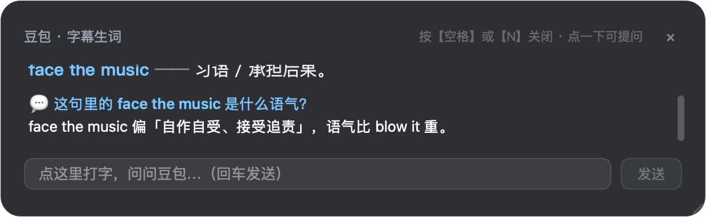

# 看剧查词-美剧 · SubtitleLookup

看美剧/英剧遇到听不懂的生词俚语，**按一下空格** —— 自动截取当前画面、丢给大模型，
几秒后在屏幕上方浮出一条解释，看完**再按一下空格关掉**，接着往下看。
全程不用切窗口、不用手动截图、不用复制粘贴。



- **快**：直连大模型 API，实测端到端约 1 秒（网页版方案要 20~75 秒）。
- **不打断播放**：全程后台完成，没有任何窗口跳出来。
- **会看眼色**：视频在播就暂停+查词，看完按空格继续播；视频本来就停着，按空格就是继续播。
- **不抢焦点**：悬浮窗不会把键盘焦点从播放器上抢走。
- **认的是整屏画面**：连画面里的台词、双关语、文化梗一起理解，不是单纯的字典查词。
- **可以接着问**：点一下浮窗就能打字追问，模型看得见刚才那张截图。
  **追问不受上面那套格式约束** —— 想问多细就问多细，它结合上下文自由回答。
- **格式固定**：句子 / 译文 / 生词 / 俚语 / 结构 各占一行、各有一色，
  不管模型这次怎么发挥，屏幕上都是同一副样子。
- **留得下来**：每次查的词会按 **剧名 + 日期** 记进「观看记录」，
  带编号和时间，这一晚看了什么都翻得到（**存哪个文件夹可以自己选**）。

> 适用：**Apple Silicon（M 系列）Mac**，macOS 12+。

<details>
<summary>和「豆包查词」是什么关系？</summary>

「豆包查词」是同一个作者的上一版，靠驱动网页版豆包完成查词（免费但慢、要扫码登录）。
本程序把「查词」这一环换成了**直连大模型 API**，快得多，也不用登录。

两个 App bundle id 不同，**可以同时装、互不干扰**。

> ★ v1.2.2 起，本程序**只剩「直连 API」一条通道**：原来那套
> 「驱动无头浏览器打开网页版豆包、再抓页面里的回答」的模块已整体删除
> （慢 20~75 秒、要维持扫码登录态、豆包前端一改版就抓不到，维护成本远大于
> 它换来的"免费"）。想继续用网页版，请装上一版「豆包查词」。
</details>

---

## 一、安装

1. 下载 `SubtitleLookup-v1.1.1-macos-arm64.zip`，解压得到 `SubtitleLookup.app`。
2. 拖进 **`/Applications`**（建议改名为「看剧查词-美剧」以便区分）。
3. 双击打开。

> ⚠️ 一定要放进 `/Applications`。macOS 的权限是按「App 路径」记的，
> 放在下载文件夹或桌面上会导致授权反复失效。

首次打开如果提示「无法打开，因为无法验证开发者」，右键 App 图标 → **打开** →
在弹出的对话框里再点 **打开** 即可（本项目是开源自签名，没有付费开发者证书，属于正常现象）。

---

## 二、首次使用：三步配好

启动后会自动弹出**控制面板**窗口（找不到的话，点 Dock 图标就能叫回来）。

### 第 1 步 · 填 API Key

面板上的「**查词引擎**」是一张卡片，填这几项就能用：

| 项目 | 填什么 |
| --- | --- |
| 服务商 | DeepSeek／豆包（火山方舟）／腾讯混元／通义千问／智谱 GLM／Kimi／**OpenRouter**／OpenAI／硅基流动／自定义 |
| **API Key** | 去服务商后台复制一个，粘进来 |
| 模型 | 默认就好（**必须是支持图片的模型**，见下） |
| Base URL | 内置服务商已预填，只有选「自定义」时才用填 |

**选完一定要点「测试连通性」** —— 它会真的生成一张带英文字幕的图发给模型，
看它能不能把文字读出来。这是判断「这个 key + 模型能不能看图」的唯一可靠办法。

> ⚠️ **模型必须支持图片（视觉/多模态）**。程序是靠截图工作的，
> 纯文本模型收不到图，会直接失败。
> 实测 DeepSeek 只有 **`deepseek-flash`** 支持图片，`deepseek-v4-pro` 不支持 —— 别换成 pro。
> 不确定就用「测试连通性」验证，它会明确告诉你行不行。

### 第 2 步 · 授权（aka 最重要的一步）

面板上会出现 ⚠️ 标记，点 **「② 去授权」** 跳到系统设置，把下面三项打开：

| 权限 | 干什么用的 | 不给会怎样 |
| --- | --- | --- |
| **辅助功能** | 监听你的空格键 | 按空格完全没反应 |
| **屏幕录制** | 截取屏幕画面 | 截图是一片黑或只有壁纸 |
| **输入监控** | 部分 macOS 版本额外要求 | 同上 |

**勾完之后，必须完全退出 App 再重开**（菜单栏 → 退出），macOS 只在程序启动时读取权限。

> 💡 如果列表里找不到本程序，点左下角的 `+` 手动选 `/Applications` 里的 App。
> ⚠️ 本程序是**新的 bundle id**，就算你已经给「豆包查词」授过权，这里也要**重新勾一次**。

### 第 3 步 · 验证

回到面板，点 **「▶ 手动查一次」**。随便放个带英文字幕的画面，
几秒后浮窗里能列出生词解释 —— 就说明整条链路通了。

---

## 三、日常怎么用

| 你想做什么 | 怎么做 |
| --- | --- |
| 查当前这幕的台词 | 视频在播时按 **空格**（会先把画面暂停，正好看清字幕） |
| 关掉浮窗、接着看 | 再按一次 **空格**（同时恢复播放） |
| 关掉浮窗但先别播 | **点浮窗外面**（不动播放状态） |
| 视频本来就停着、想继续看 | 按 **空格**（直接继续播，**不会**查词） |
| 接着问 | **点一下浮窗** → 打字 → 回车 |
| 调浮窗位置 / 大小 | 拖浮窗本体移动，拖**右下角**那个小三角缩放 |
| 调浮窗**文字大小** | 面板 → 「显示」→ 「文字大小」滑块（下面那张示例卡会实时跟着变） |
| 开关看剧模式 | 面板上的大按钮；开着才监听空格 |
| 改提示词 | 面板 → 「✏️ 编辑提示词」 |
| 翻看这一晚查过的词 | 「**观看记录**」文件，文件名是 `剧名 日期.md`（默认在桌面，可改目录） |
| 换观看记录的存放文件夹 | 面板 → 「显示」→ 「📁 选择文件夹…」（「默认」= 回到桌面） |
| 修某本记录里乱掉的序号 | 面板 → 「显示」→ 「🔢 这本重新编号（从 001 起）」 |

> **位置和大小都会自动记住**：松手那一刻就存下来，下次（包括重启程序后）还在原地、
> 还是那么大。想回到默认，面板上有「📍 重置位置与大小」。

### 观看记录（自动生成）

每次查词、每次追问的回答，都会按顺序记进 `~/Desktop/<剧名> <日期>.md`
（**存放文件夹可以改**，见本节末尾）：

```markdown
## 001 · 20:14:32

句子：You're gonna have to face the music.
译文：你迟早得自己承担后果。
生词：gonna /ˈɡɔːnə/ v. going to 的口语缩略
俚语：face the music → 承担（自己行为带来的）后果
```

- **剧名**取自 IINA 正在播放的那个窗口的文件名；
  `火星救援The.Martian.2015.…mkv` → `火星救援 The Martian`，
  `老友记.Friends.S01E03.…mkv` → `老友记 Friends`
  （画质/编码那一长串会被去掉，中英文之间会自动补空格）；
- **日期**是写入那天，所以**跨零点会自动开新文件**；中途**换剧也会开新文件**，
  两份记录不会串在一起；
- **同一部剧同一天只用一个文件**：开新本子之前会先扫一遍当天的记录，
  有同名（含"剧名是完整名的一部分"这种）就直接续写那一本，不会越开越多；
- 编号在**这一本里**接着往下排，重开程序也不会退回 001；
  如果哪本历史上序号乱了，面板上有「🔢 这本重新编号（从 001 起）」，
  点一下就把这本重排（改之前会自动留一份 `.bak`）；
- 追问会连「问了什么」一起记，不然过几天回看只剩一段没头没尾的答案；
- 追问的回答如果是**自由格式**（分点、列表、几段话），记录里也原样保留，
  不会被改写成「句子：/译文：」那套字段；
- 「这句话没有生词」那一条**不记** —— 那不是 AI 说的话，是我们自己的提示语；
- 不想要它：面板 → 「显示」→ 取消「把 AI 输出记到「观看记录」」。
  「📄 打开记录」按钮会直接在访达里定位到它。

**换个地方存**：面板 →「显示」→ 点「📁 选择文件夹…」挑一个目录；
点「默认」回到 `~/Desktop`。当前用的目录就显示在按钮旁边（可选中复制）。

### 输出格式

浮窗里的每一行都是固定形状的，**同类同色**：

| 标签 | 颜色 | 内容 |
| --- | --- | --- |
| `句子` | 蓝 | 英文原句（最粗最亮，一眼看到） |
| `译文` | 绿 | 中文翻译 |
| `生词` | 蓝 | 单词 /音标/ 词性 释义（音标自动压暗） |
| `俚语` | 橙 | 表达 → 实际含义 |
| `结构` | 紫 | 句子有省略/倒装/复杂从句时的一句话语法说明 |

这是**两件事一起保证**的：提示词里给了逐字模板（并明确禁止编号、markdown、
表格、寒暄），程序拿到回复后还会再**归一化一次** —— 所以就算模型偶尔写成
`单词 —— 释义` 或者加了个 `1.`，到浮窗里也是同一副样子。

> ⚠️ 这套格式**只管"看图查词"那一条消息**。你在浮窗里**追问**时，提示词里有一段
> **【追问规则】**明确规定：追问不受那五行模板约束 —— 它想分点就分点、想写几段就
> 写几段，一段正常的中文解释不会被硬套上「译文」「句子」标签。
> （改提示词时**请保留那段【追问规则】**，删掉它追问就可能只会回一个「无」。）

### 空格键的三种含义

空格是「一个键三种含义」，按**画面的实际状态**分流 —— 不会出现"我想接着看，
结果它又给我查了一个词"：

| 当前状态 | 按空格的结果 |
| --- | --- |
| ① 视频在播 | 暂停画面 → 截图查词 → 弹出解释 |
| ② 浮窗正显示 | 关掉浮窗 → 继续播放 |
| ③ 视频已停 | 直接继续播放（**不查词**） |

### 它会不会把我的空格吃掉？

**不会** —— 只有在下面这两种情况下才"接管"这一下空格：

- **浮窗正显示**（这时空格是"关窗并继续播"的指令）；
- 当前**最前面的应用是已知播放器**（IINA / VLC / QuickTime），也就是你正在看剧的时候。

**正在识别中 / 正在等你追问**的时候**不接管** —— 这一下空格照常送给播放器。
（v1.2.3 之前这两种状态会接管，但接管的那个分支什么都不做，表现出来就是
"按空格没反应、空格像失灵了"，已经改掉。宁可你多按一次，也不让空格键变哑巴。）

其余情况（在 Word、Slack、浏览器里打字）**空格就是空格**，该怎么用怎么用。
带 `Cmd` / `Ctrl` / `Option` 的空格（Spotlight、切换输入法）也一律不抢。

> 为什么要接管而不是直接放过去：如果你这一下空格同时被播放器和本程序各处理一次，
> 就会"暂停完立刻又播回去"，来回抵消。接管是为了让它**只生效一次**。

> 本程序**只管 IINA 这类本地播放器**。浏览器里的在线视频不在支持范围内 ——
> 那需要往 Chrome 里塞脚本，用户 2026-09-15 明确不需要，相关代码已整体删除。
> 前台是浏览器时，空格原样留给浏览器自己处理。

---

## 三之二、让 IINA 可被精确控制（推荐做，只做一次）

程序需要知道"视频现在是在播还是停着"，才能正确区分上面的 ①/③。
不做也能用，但会退化到系统媒体键（见下），**第 ③ 态会不成立**。

> **v1.2.3 起多了一层保险**：就算 IPC 一时连不上（IINA 里同时开着多个 mpv 内核时，
> 它们会互相抢那个 socket 文件），程序也能读系统的"电源断言"知道**在不在播**，
> 剧名则直接读 IINA 窗口标题（也就是磁盘上的文件名）。
> 所以「未知剧名」这类问题不会再因为 IPC 抽风而出现。这条通道**只看屏幕上可见的
> IINA 窗口标题，不碰你的隐私内容**。

### 给 IINA 开一次 mpv IPC

1. **先完全退出 IINA**（这一步不能省：IINA 退出时会用内存里的设置覆盖回去）；
2. 面板 → 「**🛠 配置 IINA 高速通道**」→ 按提示确认；
3. 重新打开 IINA，随便放个视频；
4. 面板 → 「**🎬 检测播放器**」，应该看到
   `✅ IINA（可精确读写在播/已停）`。

> 不开的话会退化到**系统媒体键**兜底：只能"切换"播放状态、读不到真实状态。
> 实测（IINA 1.4.3）暂停中的 IINA **收不到**系统媒体键（用 CPU 采样确认它没被唤醒），
> 也就是"能停、多半叫不醒" —— 所以第 ③ 态（暂停后按空格继续播）必须靠 IPC。

### 关于**全屏播放**（先说清楚，免得白折腾）

macOS 的"全屏"不是把窗口放大，而是**新建一个独占的桌面空间（Space）**。
实测结论（macOS 26 上跑了 7 种窗口参数组合）：

> **别的 App 的窗口进不去那个 Space** —— 哪怕声明了"在所有桌面可见"。
> 而窗口层级只在同一个 Space 内决定前后，所以层级调到最高也没用。

也就是说：**原生全屏时，本程序的浮窗看不到**（查词本身照常工作，只是结果没地方显示）。

目前只有一条低成本出路：

- **让 IINA 用旧式全屏**：IINA → 设置 → 通用 → 勾上
  **「使用 OS X 10.6 前的旧式全屏」**。
  这样它只是"把窗口拉满屏幕"、不建新 Space，浮窗就能正常显示，
  富文本 / 点击追问全都保留。代价是全屏不再独占一个桌面空间
  （三指滑动仍能切桌面）。

**不接受这个取舍的话，就当作全屏下没有浮窗**：不在全屏时按空格照样一切正常。

---

## 四、截图范围

面板上可以选每次截屏幕的哪一块：

- **字幕区**（默认）：只截下方一条，模型出结果最快，看剧时最合适。
- **全屏**：整屏都截，适合台词出现在画面中间的情况。
- **自定义**：点「框选…」自己拖一个框，按屏幕比例记录，换分辨率也不会跑偏。

★ 那个「**框选…**」按钮**一直都在、随时可点** —— 想改区域就再框一次，
框完立刻生效，不需要重启，也不会因为框过一遍就变灰。
框的时候是盖在**当前画面**上的（不是黑屏），左上角就是你按下的那一点；
按 `Esc` 可以取消，取消不会动原来的设置。

截得越小，出结果越快。

---

## 五、常见问题

**Q：提示「这个模型不支持图片输入」怎么办？**
换一个支持视觉的模型。DeepSeek 请用 `deepseek-flash`。
设置界面里切换模型时，下方会实时提示这个模型在不在已知支持图片的名单里。

**Q：浮窗显示「没有识别到有效文本」？**
先翻日志 `~/Library/Logs/SubtitleLookup/app.log`，看那行
`API 返回 ... 正文 x 字，思考 y 字，finish=...`：
- **`正文 0 字` + `finish=length`** → 模型的"思考过程"把回答预算吃光了
  （已自动重试一次；仍失败就按提示再按一次空格）。这不是截图的问题。
- 正文不为 0 → 才去怀疑截图范围 / 字幕是否出现。

DeepSeek 的 `deepseek-flash` 是思考型模型，程序**默认已关掉它的思考**
（`config.PROVIDERS["deepseek"]["no_think"]`），耗时从 6~33 秒降到约 1 秒。
如果自己在 `custom` 里接了别的思考型模型，可能需要在 `config.py` 里
按同样方式加一个 `no_think`。

**Q：请求超时 / 连不上服务商？**
检查网络。程序走系统代理设置（`urllib` 会读 `HTTP_PROXY` / `HTTPS_PROXY`
环境变量）。如果你开着 Clash 之类的代理软件，通常是它的节点出了问题 ——
本机实测过：同一条命令有时连 TCP 都建不起来、有时 0.7 秒就返回，
换个节点再试一次往往就好了。

**Q：启动时会不会白开一个浏览器？**
不会，而且**现在根本不碰浏览器** —— 查词走的是直连大模型 API。
（v1.2.2 起「驱动无头浏览器打开网页版豆包」那套模块已整体删除，
App 体积也从 225M 降到 92M。）

**Q：API Key 是怎么存的？**
明文存在 `~/Library/Application Support/SubtitleLookup/settings.json`，
方便手改和迁移。**别把这个文件分享给别人**，也别提交到公开仓库。
（按服务商分别存，切来切去不用重填。）

**Q：会不会很贵？**
每次查词发一张截图 + 一段提示词。按 DeepSeek 的定价，日常看剧的用量基本可以忽略。
设置里能看到每次请求的 token 消耗（写在日志里）。

**Q：能用回网页版豆包（免费那条路）吗？**
本程序不能了。它需要驱动无头 Chrome + 维持扫码登录态，一次要 20~75 秒，
豆包前端一改版就抓不到回答，维护成本远大于"免费"这个收益，
所以在 v1.2.2 被整体删除。想用网页版请装上一版「豆包查词」。

**Q：日志在哪？**
`~/Library/Logs/SubtitleLookup/app.log`，面板上「打开日志」可以直接跳过去。

**Q：按空格没反应 / 浮窗关了但视频没继续播？**
按顺序查：

1. **看日志开头有没有 `SpaceTap 空格拦截已就绪`**。没有的话说明这条通道没起来
   （多半是缺辅助功能 / 输入监控权限），此时会退回"不吞键"的老路径，功能降级但能用。
2. **「🎬 检测播放器」看走的是哪条通道**：
   - `✅ IINA（可精确读写在播/已停）` = 精确通道，读写在播/已停都准；
   - `🟡 只能靠系统媒体键切换（读不到状态）` = 兜底通道，**读不到状态**，
     也就无法可靠地区分 ①/③。想让 IINA 精确，去开一次 IPC（见「三之二」）。
3. **只看剧的窗口才管**。切到别的 App（包括浏览器）后空格不归本程序管（这是有意的）。

**Q：为什么在 IINA 里按空格能让它暂停，但暂停之后再按却不能继续播？**
这是**没开 IINA IPC** 时的典型症状。测下来已经被暂停的 IINA 收不到系统媒体键
（用 CPU 采样确认它根本没被唤醒），所以"继续播"这一下必须走 mpv IPC。
去面板点一次「🛠 配置 IINA 高速通道」就好（记得**先退出 IINA**）。

**Q：在 Word / 聊天框里空格会不会被抢？**
不会。只有当浮窗显示中、或当前最前面的应用是播放器时才接管空格。
其它应用里空格永远是空格 —— 这条有专门的回归测试盯着。

---

## 六、开发者

架构说明、模块职责、线程模型、状态机、打包签名流程见
**[docs/DEVELOPMENT.md](docs/DEVELOPMENT.md)**；
开发过程中踩过的坑见 **[docs/NOTES.md](docs/NOTES.md)**。

```bash
# 跑全部测试（离线，不花钱；测试自带临时设置目录，不动你的真实配置）
# 26 个文件，默认全静默：不会在你屏幕上弹窗、也不会抢你的前台焦点。
for f in tools/test_*.py; do python "$f"; done

# 单独跑某几个
python tools/test_providers.py     # 服务商 / key / 模型配置
python tools/test_api_client.py    # API 客户端（含"纯文本模型必须报错"）
python tools/test_lookup_api.py    # 查词主链路（messages 拼装 / 追问接历史 / 报错文案）
python tools/test_followup_answer.py # ★ 追问回答：自由格式不上标签、模板式照旧上标签
python tools/test_panel_engine.py  # 面板引擎区联动 + 「网页版残留已清」回归钉子
python tools/test_player.py        # 播放器三通道降级（IINA IPC > 电源断言 > 媒体键）
python tools/test_player_sidechannel.py # ★ 两条 IPC 旁路 + 隐私约束（只用 OnScreenOnly）
python tools/test_space_state.py   # 空格三态状态机 + 事件掩码
python tools/test_region_picker.py # ★ 框选坐标 + 能反复框（回调必到、引用必松）
python tools/test_iina_setup.py    # IINA userOptions 合并（不丢用户原有项）
python tools/test_overlay_size_memory.py  # ★ 浮窗位置+大小的记忆往返（真造窗，offscreen）

# ⚠️ 只有这一个测试允许跑在真 cocoa 上，它的实测段默认是关的。
#    想端到端验"浮窗会不会抢焦点"，显式开一次（会抢一下前台焦点，窗口本身看不见）：
DL_TEST_FOCUS_LIVE=1 python tools/test_focus_no_steal.py

# 把面板离屏渲染成图，改完界面用眼睛验收（不需要屏幕录制权限）
QT_QPA_PLATFORM=offscreen python tools/render_panel.py
# → tools/_render/panel_api.png、panel_web.png

# 打包
bash make_cert.sh    # 只需一次，生成签名证书
bash build.sh

# 打包遇到"批量删除保护"（rm -rf 被拦）时，换一对全新目录绕开
DIST=dist2 WORK=build2 SKIP_CLEAN=1 bash build.sh
```

## 许可

MIT
